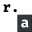

# Introdução a Rust

Olá a todos, venho aqui dar uma introdução sobre a tecnologia Rust e ajudá-los a preparar o seu ambiente para acompanhar esses tutoriais.

## Rust

Bem rust é uma linguagem criada por Graydon Hoare e em 2009 a Mozilla apoiou o projeto, e foi anunciado em 2010, sendo que a pré-alfa foi lançada em 2012 e a primeira release foi lançada em 2015.
Então é uma linguagem relarivamente nova, e foi criada com o intuito de ser segura, concorente e pratica.
Um dos grandes diferenciais é que ao inves de que se encontra em outras linguagens, Rust não utiliza Garbage Collector, ele se utiliza de uma tecnica chamada Ownership para a manipulação da memoria.

## Instalando

Para instalar o Rust é muito simples tanto no linux, Windows e Mac.

* Windows

    Para fazer a instalação no Windows, basta baixar o instalador no site oficial o [Rustup](https://www.rust-lang.org/pt-BR/tools/install), não existe segredo na instalação.

* Linux e Mac

    No caso os dois a maneira de instalar é a mesma, basta abrir o terminal e executar o comando

    ```sh
    curl https://sh.rustup.rs -sSf | sh
    ```

    Dessa maneira o instalador será baixado e executado, bastando seguir os passos para finalizar a instalação.

## Editor

Bem rust pode ser escrito aonde preferir, mas o que eu recomento pois tem todas as ferramentas para auxiliar no desenvolvimento, é eu uso no meu dia a dia é o [Visual Studio Code](https://code.visualstudio.com/), abaixo vou listar as extensões que serão de grande ajuda durante o desenvolvimento, mas caso queria usar algum outro editor ou outras extensões sinta-se livre para fazer isso.

[](https://marketplace.visualstudio.com/items?itemName=matklad.rust-analyzer) [rust-analyzer](https://marketplace.visualstudio.com/items?itemName=matklad.rust-analyzer)

[](https://marketplace.visualstudio.com/items?itemName=serayuzgur.crates) [crates](https://marketplace.visualstudio.com/items?itemName=serayuzgur.crates)

[](https://marketplace.visualstudio.com/items?itemName=tamasfe.even-better-toml) [Even Better TOML](https://marketplace.visualstudio.com/items?itemName=tamasfe.even-better-toml)

Esses são as que eu uso para utilizar Rust no meu VSCode sem nenhum problema

## Criando um projeto Rust

E para finalizar mostrarei de forma bem simples como iniciar um projeto rust e executá-lo, para caso queiram ja começar a brincar um pouco com a linguagem.

Após instalar o rustup na sua máquina existe algumas ferramentas para auxiliar o seu desenvolvimento, e uma delas é o gerenciador de pacotes, parecido com o [NPM](https://www.npmjs.com/) chamado Cargo, com ele vamos iniciar o nosso projeto é manipular as nossas dependências, mas para esse início usaremos apenas pra iniciar o projeto.

Utilizando o comando em uma pasta vazia:

```sh
cargo init --name <nome>
```

Será criado a estrutura básica para qualquer aplicação Rust, sendo o `Cargo.toml` o arquivo para definir algumas informações do projeto e colocar quais dependências vão ser usadas.
E dentro da pasta `src`, será aonde o codigo Rust será escrito.

E como de costume um exemplo de olá mundo feito em Rust:

```rust
fn main() {
    println!("Olá mundo!");
}
```

E um exemplo bobo, mas como estamos no início so para ter um gostinho de como é a linguagem eu criei um projeto nessa mesma pasta com um exemplo de como fazer o cálculo de Fibonacci.

```rust
fn main() {
    let result: u128 = fibonacci(20);
    println!("{}", result);
}

fn fibonacci(n: u128) -> u128 {
    match n {
        1 => 1,
        2 => 1,
        _ => fibonacci(n - 1) + fibonacci(n - 2),
    }
}
```

Bem espero que com o tempo aprendam mais sobre a linguagem conforme meus tutoriais, boa noite a todos, espero que tenham gostado e muito obrigado pela atenção.
